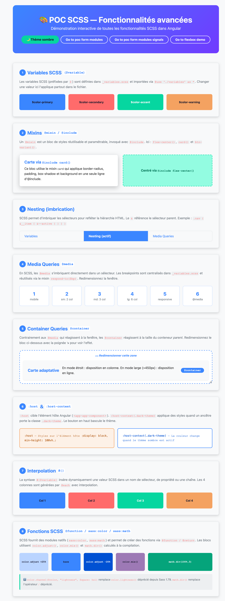
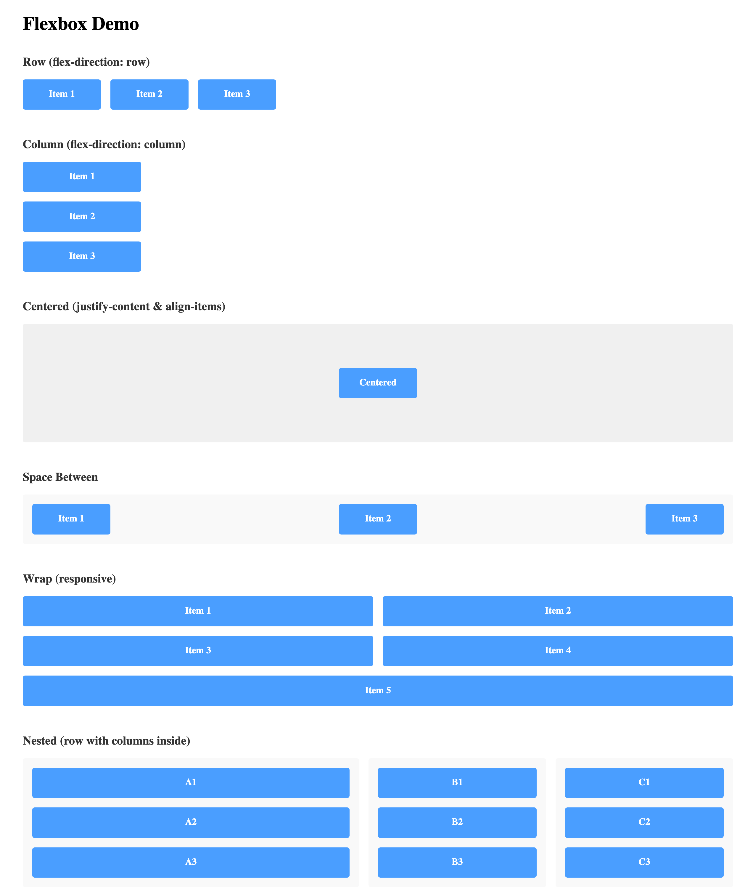

# 🚀 AngularPocFeatures

Un projet de démonstration interactive des fonctionnalités avancées d'**Angular 22** avec des POCs (Proof of Concepts) couvrant **SCSS**, **Flexbox**, et les **Reactive Forms avec Signals**.

Ce projet a été généré avec [Angular CLI](https://github.com/angular/angular-cli) version 22.0.1.

---

## 📋 Table des matières

- [Fonctionnalités](#-fonctionnalités)
- [Routes et Démos](#-routes-et-démos)
- [Démarrage rapide](#-démarrage-rapide)
- [Architecture du projet](#-architecture-du-projet)
- [Documentation complète](#-documentation-complète)

---

## ✨ Fonctionnalités

- 🎨 **POC SCSS complet** : Variables, Mixins, Nesting, @media, @container, :host, Interpolation, Fonctions
- 📦 **POC Flexbox** : Layouts responsifs et démonstrations interactives
- 📋 **Form Modules POC** : Démonstration des Reactive Forms classiques
- 🔄 **Form Modules POC Signals** : Reactive Forms avec gestion d'état par Signals
- 🎯 **Angular 20+ Best Practices** : Composants standalone, Signals, lazy loading
- 🧪 **Tests unitaires** : Jest et couverture de tests complète

---

## 🗺️ Routes et Démos

### 1. **Route `/` – POC SCSS** (AppComponent)

Démonstration interactive de toutes les fonctionnalités avancées de **SCSS** :



**Sections couvertes :**

| Section | Thème |
|---------|-------|
| **1** | Variables SCSS (`$variable`) – Palette de couleurs |
| **2** | Mixins (`@mixin` / `@include`) – `flex-center()`, `card()`, `btn-variant()` |
| **3** | Nesting – Hiérarchie BEM et imbrication native |
| **4** | Media Queries (`@media`) – Grille responsive avec breakpoints |
| **5** | Container Queries (`@container`) – Styles basés sur la taille du conteneur |
| **6** | :host / :host-context – Bindings sur l'élément hôte |
| **7** | Interpolation (`#{}`) – Génération dynamique de sélecteurs et CSS custom properties |
| **8** | Fonctions SCSS (`@function`) – `spacing()`, `contrast-color()`, modules natifs (`sass:color`, `sass:math`) |

**Accès :** [http://localhost:4200](http://localhost:4200)

---

### 2. **Route `/flexbox-demo` – POC Flexbox** (FlexboxDemoComponent)

Démonstration interactive des concepts **Flexbox** et layouts responsifs :



**Accès :** [http://localhost:4200/flexbox-demo](http://localhost:4200/flexbox-demo)

---

### 3. **Route `/formModulesPoc/test` – Form Modules POC**

POC complet des **Reactive Forms** classiques d'Angular :
- Form Groups et Form Arrays
- Validation personnalisée et asynchrone
- Gestion des erreurs
- Template-driven et Reactive approaches

**Accès :** Via le bouton *"Go to poc form modules"* sur la page d'accueil

---

### 4. **Route `/formModulesPocSignals/:numberFirst/test/:numberOfTest` – Form Modules POC Signals**

POC des **Reactive Forms intégrées avec Signals** (Angular 20+) :
- Gestion d'état avec `signal()` et `computed()`
- Décorateurs `input()` et `output()` au lieu de `@Input` / `@Output`
- Validation réactive avec Signals
- State management moderne avec signals

**Accès :** Via le bouton *"Go to poc form modules signals"* sur la page d'accueil
**Protection :** Route gardée par `oauthGuard` avec données RBAC

---

## 🚀 Démarrage rapide

### Installation

```bash
npm install
```

### Serveur de développement

Démarrez le serveur local :

```bash
ng serve
```

Accédez à l'application : [http://localhost:4200](http://localhost:4200)

L'application se recharge automatiquement à chaque modification du code source.

### Build pour la production

```bash
ng build
```

Les artefacts compilés seront stockés dans le dossier `dist/`. Le build est optimisé pour la performance et la vitesse.

### Tests unitaires

Exécutez les tests avec [Jest](https://jestjs.io/) :

```bash
npm test
```

Ou avec Angular CLI :

```bash
ng test
```

### Tests end-to-end (E2E)

```bash
ng e2e
```

---

## 📁 Architecture du projet

```
src/
├── app/
│   ├── app.config.ts           # Configuration Angular et providers
│   ├── app.routes.ts           # Routes de l'application
│   ├── oauth-guard.ts          # Guard pour authentification
│   │
│   ├── app-component/          # POC SCSS (route /)
│   │   ├── _variables.scss     # Variables centralisées
│   │   ├── app-component.ts
│   │   ├── app-component.html
│   │   └── app-component.scss
│   │
│   ├── flexbox-demo/           # POC Flexbox (route /flexbox-demo)
│   │   ├── flexbox-demo.component.ts
│   │   ├── flexbox-demo.component.html
│   │   └── flexbox-demo.component.scss
│   │
│   ├── form-modules-poc/       # POC Reactive Forms (route /formModulesPoc)
│   │   ├── form-modules-poc.ts
│   │   ├── form-modules-poc.html
│   │   ├── form-modules-poc.routes.ts
│   │   └── form-modules-poc.scss
│   │
│   └── form-modules-poc-signals/  # POC Signals (route /formModulesPocSignals)
│       ├── form-modules-poc-signals.ts
│       ├── form-modules-poc-signals.html
│       ├── form-modules-poc-signals.routes.ts
│       └── form-modules-poc-signals.scss
│
├── styles.scss                 # Styles globaux
└── index.html                  # Page HTML principale

public/
└── assets/
    └── images/
        ├── SCSS.png            # Capture POC SCSS
        └── flex.png            # Capture POC Flexbox
```

---

## 🛠️ Stack technologique

- **Angular** 22.0.1 (Standalone Components)
- **TypeScript** 6.0.3 – Strict mode
- **SCSS** – Modules natifs (sass:color, sass:math)
- **Reactive Forms** – Avec validation personnalisée et asynchrone
- **Signals** – Gestion d'état réactive (Angular 22)
- **Jest** 30.4.2 – Framework de test unitaire
- **RxJS** 7.8.0 – Programmation réactive

---

## 📚 Documentation complète

### Angular CLI – Commandes scaffolding

Générez rapidement de nouveaux composants :

```bash
ng generate component nom-du-composant
```

Pour une liste complète des schematics disponibles :

```bash
ng generate --help
```

### Ressources officielles

- 📖 [Documentation Angular](https://angular.dev)
- 🔧 [Angular CLI Overview and Command Reference](https://angular.dev/tools/cli)
- 🎨 [SCSS / Sass Documentation](https://sass-lang.com)
- ♿ [WCAG 2.1 Guidelines](https://www.w3.org/WAI/WCAG21/quickref/)

---

## 👨‍💻 Bonnes pratiques appliquées

✅ **Composants Standalone** – Par défaut en Angular 22  
✅ **Signals** – Pour la gestion d'état réactive (Angular 22)
✅ **Lazy Loading** – Routes chargées dynamiquement  
✅ **OnPush Change Detection** – Performance optimale  
✅ **Reactive Forms** – Validation robuste et réactive  
✅ **Pas de `ngClass`/`ngStyle`** – Utilisation des bindings natifs  
✅ **Control Flow natif** – `@if`, `@for`, `@switch` au lieu de `*ngIf`, `*ngFor`  

---

## 📝 Notes

Ce projet est une ressource pédagogique dédiée aux **POCs et démonstrations** de fonctionnalités Angular avancées. Il est idéal pour :

- 📚 Apprendre les meilleures pratiques Angular 22
- 🎨 Maîtriser les fonctionnalités avancées de SCSS
- 📋 Comprendre la gestion d'état avec Signals
- 🧪 Écrire des tests unitaires robustes

---

**Généré avec ❤️ et Angular CLI 22.0.1**
